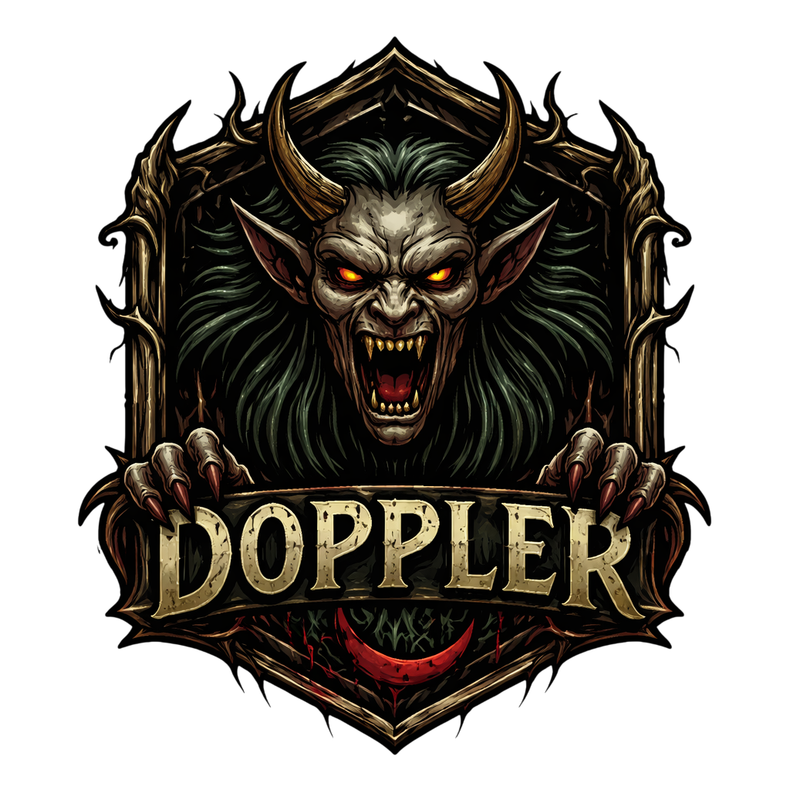
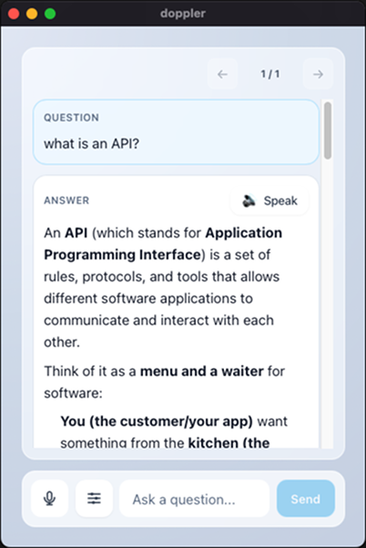
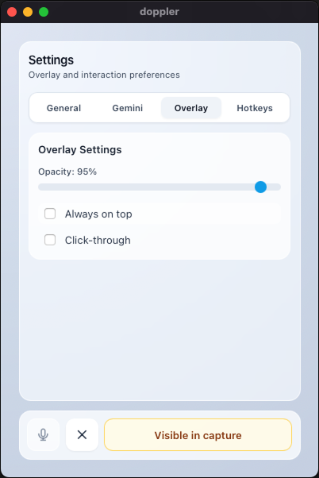

<div align="center">
  
  
  # Doppler
  
  **Voice-First AI Assistant for Desktop**
  
  A cross-platform desktop application for seamless interaction with LLMs through text and voice.
  
  [](https://tauri.app/)
  [](https://kit.svelte.dev/)
  [](https://www.rust-lang.org/)
  [](https://www.typescriptlang.org/)
  
</div>

---

## Overview

Doppler is a lightweight, privacy-focused desktop assistant that combines the power of LLMs with voice interaction. Built with Tauri, it offers native performance with a minimal footprint.

### Screenshots

<div align="center">
  
  
</div>

### Key Features

- **Text Chat** — Direct text-based interaction with Gemini API
- **Voice Input** — Speech-to-text for hands-free queries
- **Voice Output** — Text-to-speech responses using native OS engines
- **Overlay Mode** — Always-on-top, transparent window with adjustable opacity
- **Global Hotkeys** — Quick access from anywhere on your system
- **Secure Storage** — API keys stored in OS-native secure storage (Keychain/Credential Manager)
- **Cross-Platform** — Native support for macOS and Windows

---

## Technology Stack

### Frontend
- **SvelteKit** — Modern reactive framework with file-based routing
- **TypeScript** — Type-safe development
- **Tailwind CSS** — Utility-first styling
- **Vite** — Fast build tooling

### Backend
- **Rust** — High-performance system integration
- **Tauri** — Lightweight desktop framework
- **cpal** — Cross-platform audio capture
- **tts** — Native text-to-speech
- **reqwest** — HTTP client for API communication

---

## Getting Started

### Prerequisites

- **Node.js** 18+ and npm
- **Rust** 1.77.2+ (install via [rustup](https://rustup.rs/))
- **System dependencies:**
  - macOS: Xcode Command Line Tools
  - Windows: Visual Studio Build Tools

### Installation

1. Clone the repository:
```bash
git clone <repository-url>
cd doppler
```

2. Install frontend dependencies:
```bash
npm install
```

3. Install Rust dependencies (automatic on first build)

### Development

Run the development server:
```bash
npm run dev
```

This starts both the Vite dev server and Tauri in development mode with hot-reload.

### Building

Create a production build:
```bash
npm run build
npm run tauri build
```

The compiled application will be in `src-tauri/target/release/bundle/`.

---

## Project Structure

```
doppler/
├── src/                      # Frontend (SvelteKit)
│   ├── lib/
│   │   ├── components/       # Svelte components
│   │   ├── stores/           # State management
│   │   ├── tauri/            # Tauri command wrappers
│   │   └── utils/            # Utility functions
│   └── routes/               # SvelteKit routes
├── src-tauri/                # Backend (Rust)
│   ├── src/
│   │   ├── commands.rs       # Tauri command handlers
│   │   ├── gemini.rs         # Gemini API client
│   │   ├── audio.rs          # Audio recording
│   │   ├── storage.rs        # Secure key storage
│   │   └── models.rs         # Data models
│   └── Cargo.toml
├── static/                   # Static assets
└── package.json
```

---

## Usage

### First Launch

1. Download and install the application
2. Launch Doppler
3. Navigate to Settings (gear icon)
4. Enter your [Gemini API key](https://aistudio.google.com/app/apikey)
5. Click "Save" to securely store the key

The API key is stored in OS-native secure storage:
- macOS: Keychain
- Windows: Credential Manager

### Ollama (Windows / Linux / macOS)

Setup instructions for local Ollama are here:

- [docs/ollama-setup.md](docs/ollama-setup.md)

### Handy (Local STT)

Setup instructions for Handy local speech-to-text are here:

- [docs/handy-setup.md](docs/handy-setup.md)

### Text Chat

1. Type your question or prompt in the input field
2. Press `Enter` or click "Send"
3. Wait for the AI response
4. Continue the conversation naturally

### Voice Input

1. Click the "Record" button or press `Cmd/Ctrl + Shift + R`
2. Speak your question
3. Click "Stop" or press the hotkey again
4. Review the transcribed text
5. Edit if needed and send

### Voice Output

- Click "Speak" to hear the AI response read aloud
- Click "Stop Speak" to interrupt playback
- Enable "Auto-speak" in Settings for automatic voice responses

### Global Hotkeys

Access Doppler from anywhere on your system:
- `Cmd/Ctrl + Shift + X` — Show/hide the application
- `Cmd/Ctrl + Shift + Space` — Toggle app (alternative)
- `Cmd/Ctrl + Shift + R` — Start/stop voice recording

Customize hotkeys in Settings → Hotkeys.

### Overlay Mode

For a non-intrusive experience:
1. Enable "Always on top" in Settings
2. Adjust opacity for transparency
3. Enable "Click-through" to interact with apps beneath
4. Use hotkeys to control without switching focus

---

## Development Guidelines

This project follows strict coding standards. Please review:

- [Rust/Tauri Standards](src-tauri/AGENTS.md)
- [SvelteKit/TypeScript Standards](src/AGENTS.md)
- [Commit Style Guide](COMMIT_STYLE.md)

### Key Principles

- Keep Tauri commands thin — business logic belongs in application services
- Use TypeScript strictly — avoid `any`, prefer explicit types
- Follow SvelteKit conventions — use `load` functions, form actions, and route files properly
- Isolate Tauri calls behind a frontend boundary layer
- Write readable, top-down code with clear naming

### Validation Commands

Before committing:

**Frontend:**
```bash
npm run check          # Type checking
```

**Backend:**
```bash
cd src-tauri
cargo fmt              # Format code
cargo clippy --all-targets --all-features -- -D warnings
cargo test             # Run tests
```

---

## Architecture

### Frontend Flow
```
Route → Load Function → Page Component → Child Components
```

### Tauri Integration
```
Component Event → Frontend Boundary (commands.ts) → Rust Command → Service Layer
```

### Key Modules

- **Commands** — Thin Tauri command adapters
- **Application** — Business logic and use cases
- **Infrastructure** — External integrations (API, filesystem, audio)
- **State** — Shared application state

---

## Acknowledgments

Inspired by:
- [Handy](https://github.com/cjpais/Handy) — STT and desktop architecture patterns
- [cheating-daddy](https://github.com/sohzm/cheating-daddy) — Overlay UX and Gemini integration

---

<div align="center">
  Built with ❤️ using Tauri, SvelteKit, and Rust
</div>
